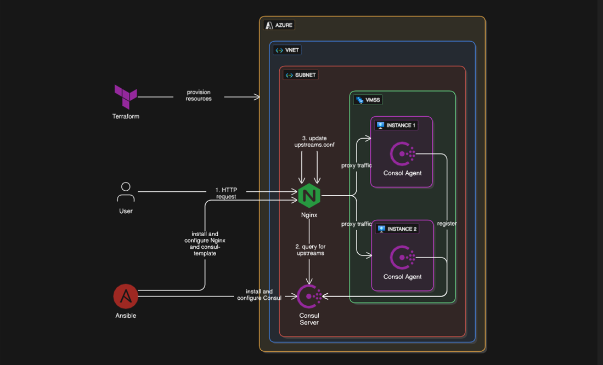

# Nginx Dynamic Service Discovery with Consul

### This project demonstrates **dynamic service discovery** on Nginx using **Consul**.
---

## Overview

A small web app (Flask in Docker) runs on VMs inside an Azure VM Scale Set (VMSS). Each VM has a Consul agent that registers the app with a central Consul server.
On the Nginx VM, Consul-template watches the Consul server and updates Nginx upstreams whenever backends change (new VM, removed VM, or unhealthy VM).

The result: **when VMSS scales in or out, Nginx stops or starts proxying requests to it dynamically.**

---

## Architecture

- VM Scale Set (VMSS) → runs backend VMs with a sample web app.
- Consul agent → registers each backend with the Consul server.
- Consul server → keeps the service registry.
- Consul-template → queries the Consul server and updates Nginx config automatically based on the queried data.
- Nginx → acts as the entrypoint and load balancer.
- Terraform → provisions the infrastructure and uses cloud-init (set of commands that run automatically on new VMs at startup) to install Consul agents, set up the web app environment, and launch the app.
- Ansible → configures Consul server, Nginx, and Consul-template.

---

## Prerequisites

- Azure subscription
- Terraform
- Ansible
- Load testing tool (e.g. wrk or ab)
